# HTB Bedside — A Clinic That Trusted Every File It Was Handed

**Difficulty:** Medium | **OS:** Linux | **Platform:** HackTheBox

> This writeup documents the exploitation of *Bedside*, a legal target on the HackTheBox training platform. It is shared for educational purposes only — never run these techniques against systems you do not own or have explicit authorization to test.

## Summary

Bedside is a Linux box built around a fictional heart clinic that is "transitioning to AI." Underneath the marketing copy, the box turns out to be a chain of two nearly identical mistakes made in two different places: a file-upload workflow that unpickles attacker-controlled data through `pdfminer.six`, and a model-training script that does the exact same thing through `torch.load`. Getting from an anonymous HTTP request to `root` means finding both, plus a Docker-to-host pivot in between.

At a glance, the path looks like this:

1. Recon turns up only SSH and HTTP.
2. A vhost fuzz uncovers a hidden `research.bedside.htb` upload portal.
3. The response headers leak the parsing library in use (`pdfminer.six`), which points at a recent deserialization CVE.
4. A two-file polyglot upload achieves code execution inside a Docker container once a background watcher parses it.
5. A path traversal bug in an internal-only service (reachable via the Docker bridge) discloses the host's `/etc/passwd` and a developer's SSH key.
6. On the host, a passwordless `sudo` entry for a MONAI training script repeats the same insecure-deserialization flaw — this time via a poisoned PyTorch checkpoint — for `root`.

---

## Phase 1 — Reconnaissance

Standard first step: find out what's actually listening before touching anything else.

```bash
ping 10.129.248.191
nmap -sV -sC -Pn 10.129.248.191
```

The scan came back with exactly two open ports — `22/tcp` (OpenSSH 10.0p2) and `80/tcp` (Apache 2.4.68, hosting *"Bedside Clinic"*). Both services were on recent, patched versions, which is usually a signal on a Medium box: the vulnerability isn't going to be the software itself, it's going to be whatever was built on top of it. The HTTP title also revealed the hostname, so `bedside.htb` went straight into `/etc/hosts`.

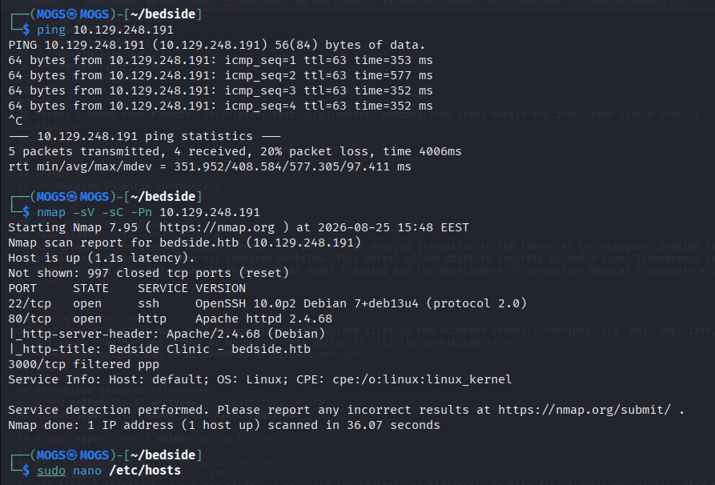
*Confirming the host is alive and enumerating the two open services with Nmap.*

---

## Phase 2 — Web Enumeration

The front page at `http://bedside.htb` is a static marketing site — an "About," a "Treatments" section, an "AI Innovations" blurb, and a contact block. Nothing interactive, nothing that takes input.


*The public-facing marketing site — polished, but entirely static.*


*The only concrete detail worth keeping here was the `contact@bedside.htb` address, confirming the mail/username format.*

With nothing to attack on the front end, the next logical move was to check for other virtual hosts sitting on the same IP. `ffuf` against the `Host` header, first with all status codes visible to establish a baseline:

```bash
ffuf -u http://bedside.htb -H "Host: FUZZ.bedside.htb" \
     -w /usr/share/seclists/Discovery/DNS/subdomains-top1million-110000.txt -mc all
```


*Every non-existent vhost redirects with a 301 — that becomes the filter for the next pass.*

Filtering that baseline out (`-fc 301`) isolated the one entry that actually resolved to something different:

```bash
ffuf -u http://bedside.htb -H "Host: FUZZ.bedside.htb" \
     -w /usr/share/seclists/Discovery/DNS/subdomains-top1million-110000.txt -mc all -fc 301
```


*`research` returns a 200 with a distinct response size — a second site the front page never linked to.*

`research.bedside.htb` was added to `/etc/hosts` and became the real focus of the box.

---

## Phase 3 — Foothold: The Research Portal

### An upload form with an interesting library behind it

The research vhost is a "Bedside Research Portal" that lets staff upload X-rays, CT scans, and other research files to "support AI model training." Crucially, it advertises that "collections can be uploaded as archives" and that some formats get converted before use — both signs of non-trivial server-side file handling.


*A genuine file-upload form, with a notice that archives are accepted and some formats get converted server-side.*

Before touching the form, checking the raw response headers paid off immediately:

```bash
curl -s -i http://research.bedside.htb/
```


*`X-Powered-By: pdfminer.six` — not a header any framework sets on its own, which means a developer added it deliberately. This single line points straight at the vulnerability class to chase.*

A quick, harmless upload confirmed the endpoint accepted PDFs and stored them under the submitted filename without echoing back a path:

```bash
echo "%PDF-1.4 test" > /tmp/bedside.pdf
curl -s -F "uploadFile=@/tmp/bedside.pdf" http://research.bedside.htb/
```

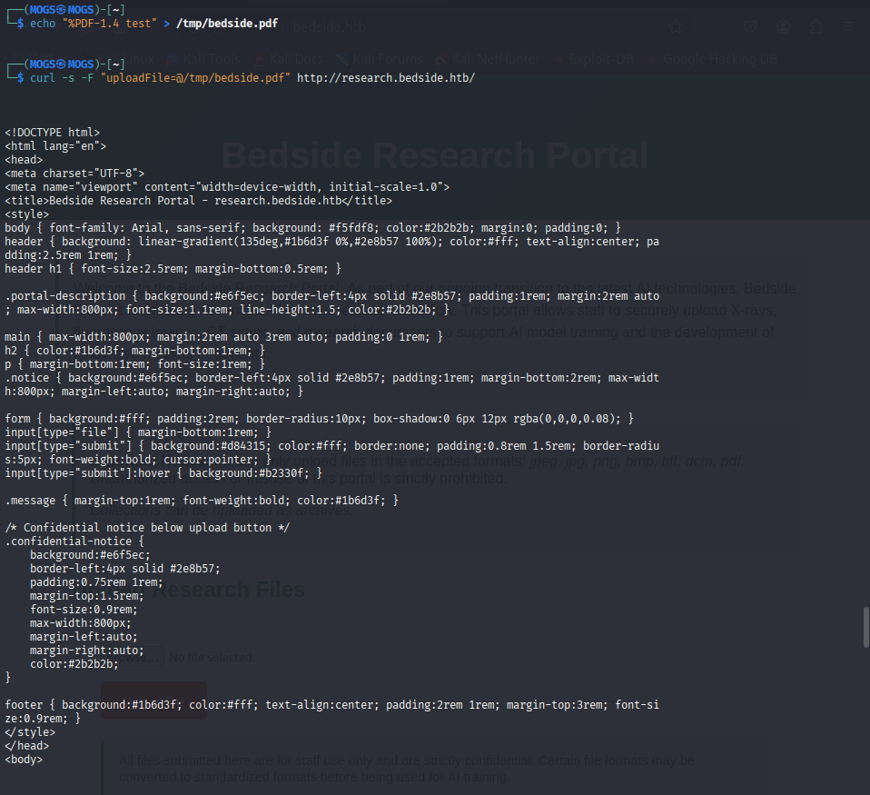
*A clean PDF upload succeeds — no processing output is returned directly to the client, which suggested the actual parsing happens out-of-band.*

Sending a file that should be rejected was more informative than sending one that worked. An arbitrary non-image file produced an error that leaked far more than intended:

```bash
curl -s -F "uploadFile=@/etc/hostname" http://research.bedside.htb/ | grep -A1 'class="message"'
```

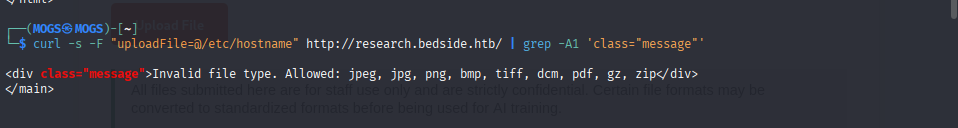
*The rejection message listed `gz` and `zip` as accepted formats — neither of which the portal's own UI advertised. Undocumented archive support on a server that parses documents server-side is exactly the kind of thing worth pulling on.*

### Reaching the deserialization bug

`pdfminer.six` in this window had a fresh CVE (CVE-2025-64512): CMap resolution for a font's `/Encoding` entry can be pointed at an arbitrary `.pickle.gz` path, and the library unpickles that file without validation. Combined with the fact that `.gz` uploads were quietly permitted, this was a workable chain — provided the payload actually gets parsed by something. A single self-referencing polyglot file sat inert on disk with no reaction, which made sense once a background process was found on the container:

```bash
cat /app/pdf_watcher.py
```


*A cron-style loop polls the upload directory every 30 seconds for `*.pdf` files and feeds each one to `pdf2txt.py` — `pdfminer.six`'s own CLI. Filename checks block path traversal, symlinks, and non-regular files, but nothing stops a legitimate-looking PDF from referencing a malicious `.pickle.gz` sitting next to it.*

Splitting the payload into two files — a real `.pickle.gz` carrying the malicious pickle, and a companion `trigger.pdf` whose `/Encoding` pointed at it — let the watcher's own polling cycle do the work. Roughly 30 seconds after both files landed in the upload directory, a reverse shell connected back as `datawrangler` inside a container called `data-wrangler`.

---

## Phase 4 — Lateral Movement: Escaping the Container

### Mapping the Docker bridge

The shell was minimal — no `nmap`, no `nc`, just `curl` and `python3`. The default gateway (the standard Docker bridge, `172.17.0.1`) was swept with a small inline Python socket scanner:

```python
import socket
for p in [22,80,3000,5000,8000,8080,9000]:
    s=socket.socket(); s.settimeout(0.6)
    if s.connect_ex(("172.17.0.1",p))==0: print("OPEN",p)
    s.close()
```

Port `3000` stood out immediately — an internal-only service that external Nmap never saw, since it's bound to the Docker bridge and not exposed publicly.

### Path traversal on the internal image viewer

Port 3000 served a small "MRI slice viewer" whose data turned out to be entirely client-side generated (a dead end). But the *web server* hosting that static app was still worth attacking directly. A raw traversal request against its root, sent with `--path-as-is` so curl wouldn't normalize the `../` sequences away, reached files far outside the intended web root:

```bash
curl -s --path-as-is 'http://172.17.0.1:3000/../../../../etc/passwd'
curl -s --path-as-is 'http://172.17.0.1:3000/../../../../home/developer/.ssh/id_rsa'
```

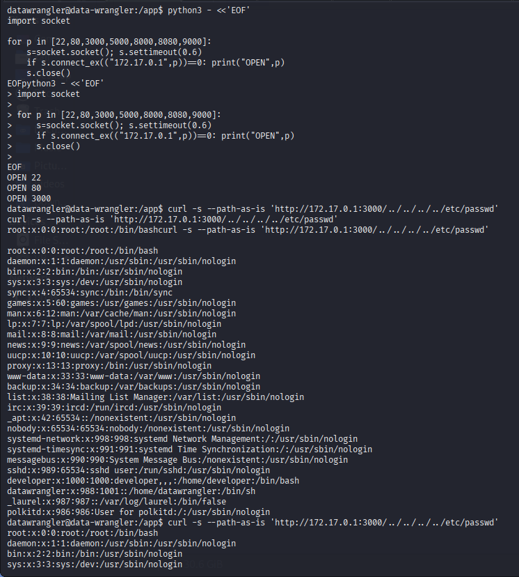
*The returned `/etc/passwd` belonged to the host, not the container — extra accounts like `developer` and `_laurel` confirmed the traversal was reaching real host files through the bridge-only service.*


*The same technique pulled `developer`'s unencrypted `id_rsa` straight off disk.*

### Landing on the host

With the key retrieved and permissions fixed locally, SSH as `developer` dropped a full shell directly on the host — no container this time.

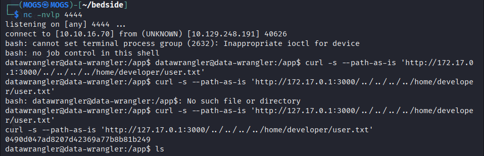
*The reverse shell landing inside the `data-wrangler` container, followed by the same traversal technique confirming access to `home/developer/user.txt`.*

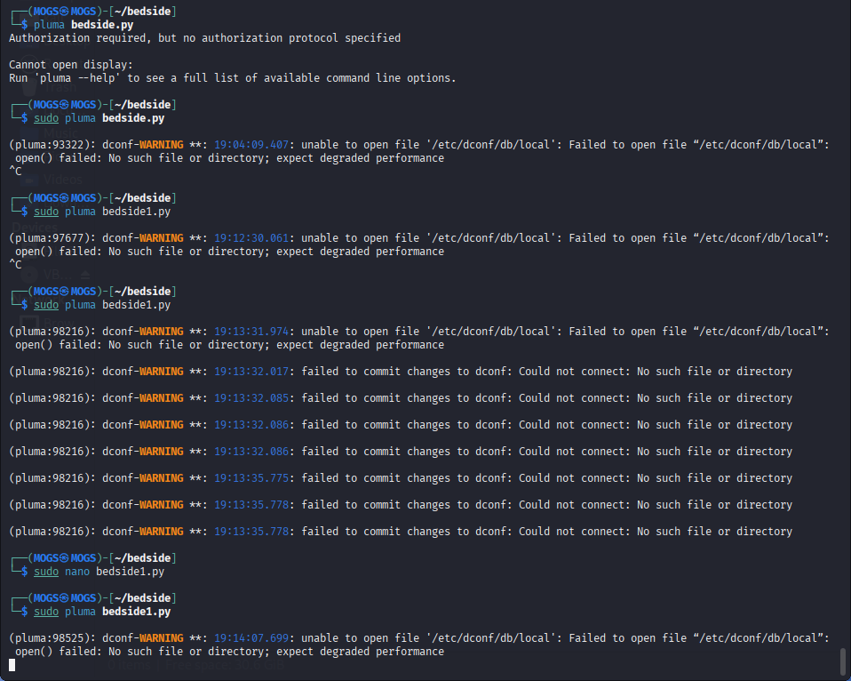
*Iterating on the two-stage exploit script (`bedside1.py`) that uploads the pickle/trigger pair and automates the SSH pivot once the key is recovered.*

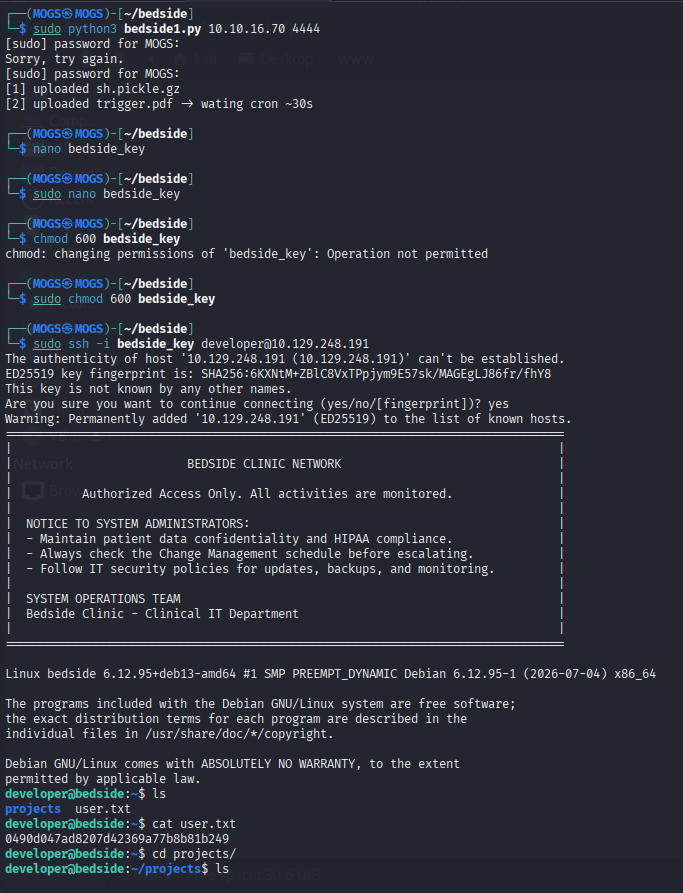
*Authenticating to the host directly with the stolen key, landing in `developer`'s home directory with `user.txt` readable — user flag secured.*

---

## Phase 5 — Privilege Escalation: The Same Bug, Wearing a Different Coat

`sudo -l` for `developer` showed exactly one entry:

```
(ALL) NOPASSWD: /usr/bin/python3 /opt/trainer/bedside_trainer.py
```

Reading the script revealed a MONAI-based trainer that, on finding an existing checkpoint in `/datastore/checkpoints/`, loads it through MONAI's `CheckpointLoader` — which resolves to `torch.load(..., weights_only=False)` under the hood. That call deserializes with `pickle`, exactly like the pdfminer bug earlier in the chain. Whoever built this box made the same mistake twice, in two different libraries, in two different trust boundaries.

Two obstacles stood between "found the bug" and "own root":

- **Permissions:** `developer` couldn't write to `/datastore/checkpoints/` directly — that directory belonged to the `dataops` group, which `datawrangler` (the container account) *was* in. The shared `/datastore` volume was the seam: `datawrangler` could drop files, `developer` could trigger the trainer that reads them.
- **File format:** `torch.load` doesn't accept a bare pickle — it expects a ZIP archive (`archive/data.pkl` + `archive/version`), so the payload had to be built as a proper "torch checkpoint" wrapping a malicious `__reduce__`.

```bash
head -c4 checkpoint_epoch_99.pt | od -An -tx1   # confirm real checkpoints are ZIP (PK) files
```

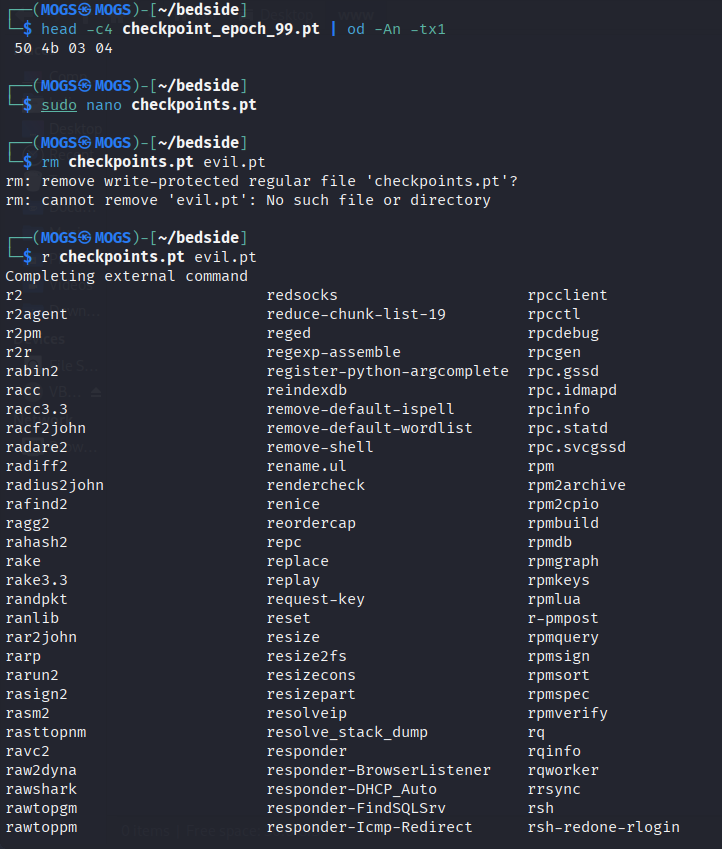
*Verifying the expected format before building the malicious replacement — the file starts with `50 4b 03 04`, standard ZIP/PK magic bytes.*

A small builder script (`evil.pt`) assembled a matching ZIP containing a pickled `__reduce__` payload:

```bash
sudo python3 evil.pt
python3 -m http.server 8000
```

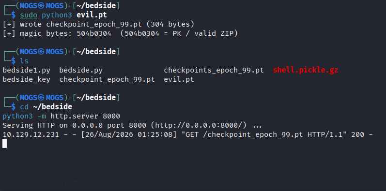
*The forged checkpoint is written with valid ZIP/PK magic bytes and served over a throwaway HTTP server for the container to pull down.*

From the `data-wrangler` container (with `dataops` group membership), the forged checkpoint replaced the legitimate one in `/datastore/checkpoints/`, and a valid image was staged in `/datastore/processed/` so the trainer's data-gate would actually proceed far enough to reach the checkpoint loader:

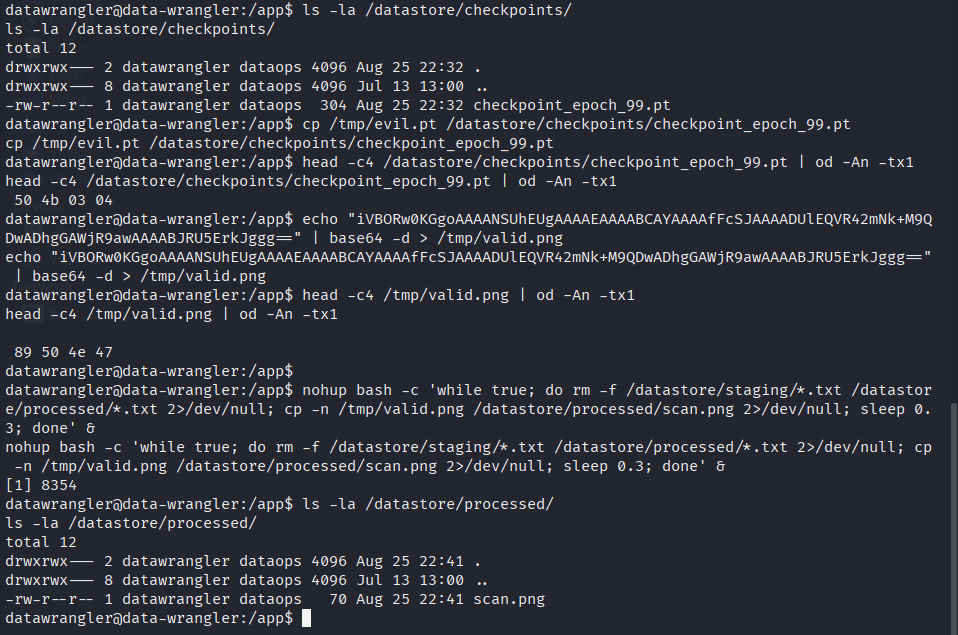
*Copying the poisoned checkpoint into place, confirming its magic bytes match a real one, and priming `/datastore/processed/` with a valid image so the training script won't exit early for lack of data.*

Back on the host as `developer`, running the permitted `sudo` command loaded the poisoned checkpoint as `root`:

```bash
sudo /usr/bin/python3 /opt/trainer/bedside_trainer.py
```

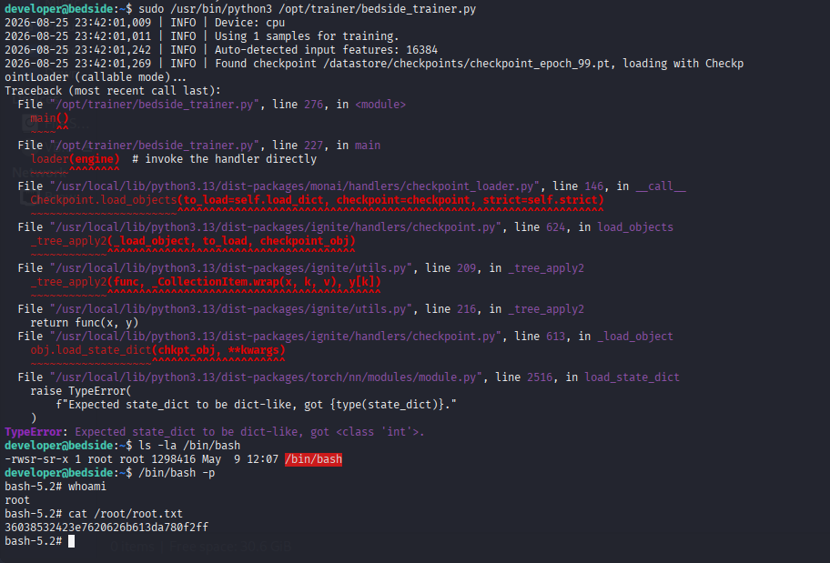
*The trainer throws a `TypeError` after the pickle has already executed — the payload set the SUID bit on `/bin/bash` before the loader's error surfaced. `/bin/bash -p` drops straight into a root shell, confirmed by `whoami` and `root.txt`.*

---

## Root Cause & Takeaways

Bedside's entire chain rests on one recurring theme: **loading data as code without validating trust boundaries first.**

- **`pdfminer.six` CMap handling** treated a font's `/Encoding` reference as a safe path to unpickle, letting an uploaded file reach into arbitrary application state the moment a background job parsed it.
- **`torch.load(weights_only=False)`** did the same thing for "trusted" model checkpoints — trusting a file's *location* (a directory named `checkpoints`) instead of validating its contents.
- **Shared storage across a Docker trust boundary** (`/datastore`) let a lower-privileged container account stage a payload that a higher-privileged host process would later execute.
- **An internal-only service** (port 3000, reachable only via the Docker bridge) still had a classic path traversal bug, proving that "not exposed externally" is not the same as "safe."

### Defensive notes

- Never deserialize untrusted data with `pickle` (directly or via `torch.load` / MONAI's `CheckpointLoader`) — use `weights_only=True`, or a format that doesn't execute arbitrary code on load (e.g., `safetensors`).
- Treat any user-controlled path used in file parsing (including embedded references like PDF `/Encoding` entries) as attacker input, even several layers removed from the original upload.
- Apply least privilege to shared volumes between containers — a compromised low-privilege container should never be able to write into a path that a higher-privileged process will blindly trust.
- Validate uploaded file types by content, not just extension — and keep that validation logic in sync with what's actually documented to users.

---

*Flags omitted/redacted intentionally in this writeup. This document reflects an authorized run against the HackTheBox "Bedside" lab machine.*
